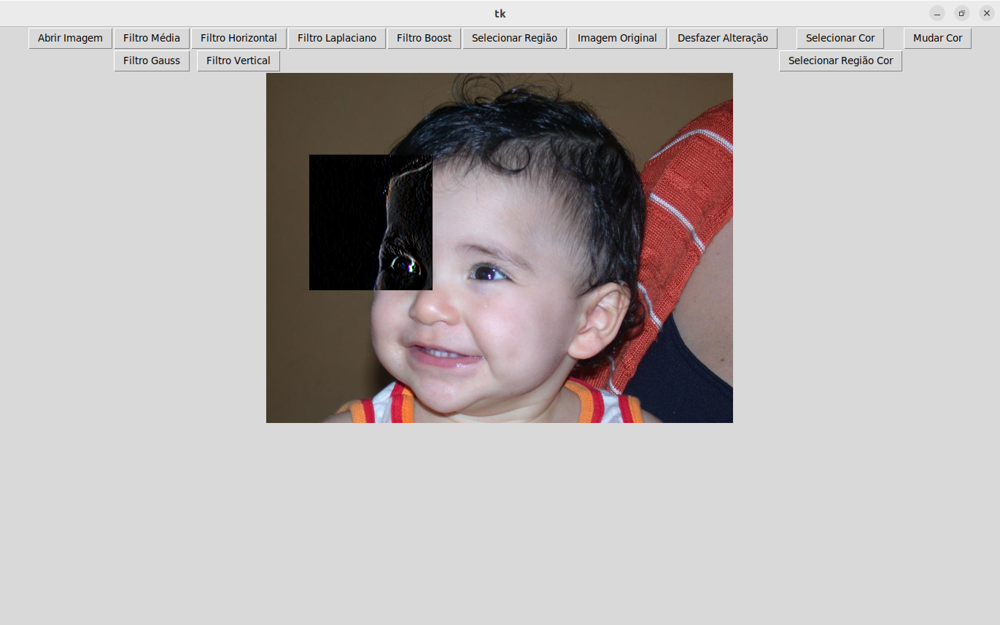

# Editor de imagem simples utilizando OpenCV

## Descrição do projeto

Foi desenvolvido um editor de imagem simples utilizando OpenCV para tratar as imagens e o tkinter para construir a interface gráfica

No editor é possível aplicar alguns filtros como por exemplo o de detecção de linhas verticais e horizontais, e além disso, é possível  trocar a cor de uma região selecionada.

## Requisitos

* Python 3

## Como utilizar 

Primeiro é necessario realizar o clone do repositorio  utilizando o seguinte comando:

```sh
	git clone git@github.com:IgorDiasV/editor_de_imagem_simples.git
```

Após isso é necessario instalar as dependências python presentes no arquivo requeriments utilizando o seguinte comando:

```sh
	python3 install -r requeriments.txt
```

## Aplicação

O programa conta com uma única janela, ela possui todos os botões necessarios para aplicar os filtros e realizar mudanças de cores. A interface com uma imagem já aberta pode ser visto na figura abaixo.


###### Figura 1 - Interface

Para Realizar a aplicação de um filtro em toda a imagem é preciso apenas clicar no botão correspondente ao filtro desejado. Na figura 2 é possível visualizar o resultado da aplicação do filtro horizontal em uma imagem de exemplo. 


###### Figura 2 - Aplicação do Filtro Horizontal

Para realizar a aplicação de um filtro em uma determinada região é preciso primeiro usar a função de selecionar região e após finalizada a selação aplicar o filtro desejado. Na figura 3 é possível ver um exemplo.


###### Figura 3 - Aplicação do Filtro Horizontal em um região específica

Outra funcionalidade de aplicação e realizar a mudança de cor. Isso pode ser realizado de duas maneiras. A primeira consiste em clicar no pixel com a cor que se quer trocar e depois selecionar a nova cor clicando em mudar cor. Uma outra alternativa, é selecionar um região com a cor que se deja trocar e após isso realizar a mudança de cor. Um exemplo pode ser visto abaixo.


###### Figura 4 - Mudança do plano de fundo

